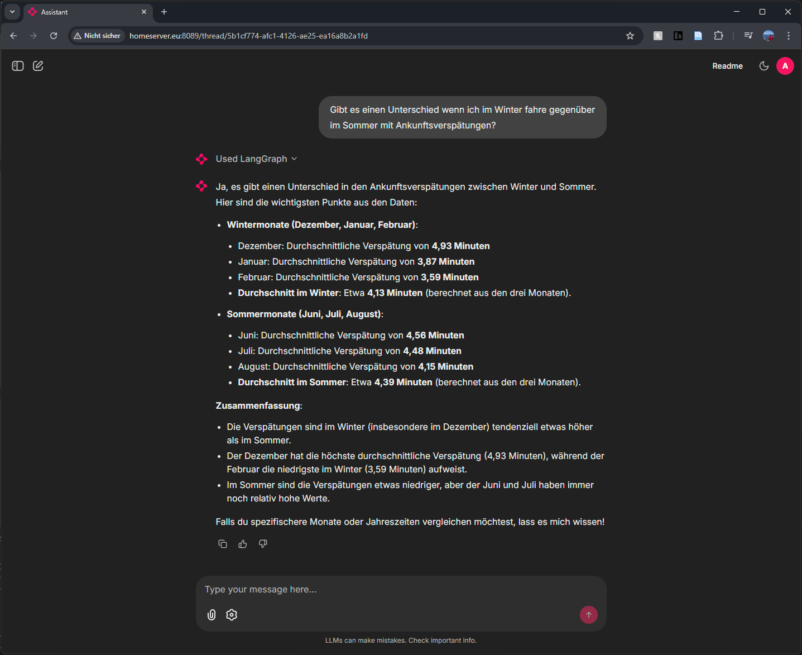

# T2TSDB: Architektur und Evaluation einer Multi-Agent-Lösung für Text-to-SQL in Zeitseriendatenbanken

Dieses Repo enthält den Quellcode und die zugehörigen Materialien für die Masterarbeit "T2TSDB: Architektur und Evaluation einer Multi-Agent-Lösung für Text-to-SQL in Zeitseriendatenbanken", die im Rahmen des Studiengangs Data Intelligence an der Fachhoschule St. Pölten erstellt wurde.





## Zusammenfassung

Von der natürlichsprachlichen Frage zur Abfrage für Zeitreihendatenbanken und wieder zurück. In dieser Arbeit wird geprüft, inwieweit Open-Source-LLMs unter realistischen On-Premises-Bedingungen ausführbare NL-to-SQL-Abfragen erzeugen, und laienverständliche Interpretationen liefern. Verglichen werden Mistral Small 3.2 und Gemma 3 27B mit GPT-4.1 mini in einer reproduzierbaren Multi-Agent-Architektur („T2TSDB-Agent“) mit Supervisor-, Query- und Interpretations-Agent auf einem gerichteten Zustandsgraphen. Bewertet werden Ausführbarkeit, Plan- und Ausführungszeiten mittels EXPLAIN ANALYZE, Precision und Recall sowie LLM-as-a-Judge für SQL-Semantik und Textinterpretationsqualität.

Die Ausführbarkeit ist bei OpenAI am höchsten mit 98,02%, gefolgt von Gemma mit 93,07% und Mistral mit 86,13 %. Gemma erreicht die kürzesten Laufzeiten mit −51% gegenüber Gold-SQL, OpenAI liegt bei −16%, Mistral bei +45 %. Die Mittelwerte von Precision und Recall bleiben niedrig (Mistral 0,06/0,07, Gemma 0,04/0,04 und OpenAI 0,10/0,10). Der niedrige Recall entsteht vor allem durch systematische Auslassungen infolge asymmetrischer Tabellennutzung, zu engen oder unpassenden Zeit- und Attributfiltern sowie Aggregationen auf nicht übereinstimmender Granularität, wodurch relevante Zeilen aus der Ergebnismenge fallen.

Open-Source-Modelle sind On-Premises grundsätzlich einsetzbar, weisen jedoch bei komplexeren Abfragen semantische Präzisionslücken auf. Ein vorgelagerter Validierungs-Agent und ein kuratiertes „SQL-Gedächtnis“ aus Gold-Abfragen sind geeignete Hebel, um Zusatz- und Auslasstreffer zu reduzieren, ohne Effizienz- und Interpretationsvorteile einzelner Modelle aufzugeben.


## Struktur dieses Repos

- `app/`: Enthält den T2TSDB agent und eine Frontend-Anwendung zur Interaktion mit dem Agenten.
- `db/`: Beinhaltet die Datenbank-Schemata und -Migrationsdateien für die Frontend-Anwendung.
- `localstack/`: Enthält die Konfiguration für einen S3-kompatiblen Speicher, welcher für die Frontend-Anwendung verwendet wird.
- `questions/`: Beinhaltet den 101 Fragenkatalog, welcher zur Evaluierung verwendet wurde. In diesem sind auch alle Ergebnisse dokumentiert.
- `validation/`: Beinhaltet die Validierungslogik und -tests für die gesamte Arbeit, unterteilt nach den vier verschiedenen Ansätzen. Zusätzlich enthält dieser die Diagramme, welche in der Arbeit verwendet wurden.
- `docker-compose.yml`: Beinhaltet die Konfiguration für die Docker-Container, welche die fertige Frontend-Anwendung mit dem T2TSDB-Agenten orchestriert.
- `Dockerfile`: Enthält die Dockerimage definition für die Frontend-Anwendung mit dem Agenten
- `requirements.txt`: Beinhaltet die Python-Abhängigkeiten für die Frontend-Anwendung.


## WICHTIGER HINWEIS

Diese Umgebung ist NICHT für den produktiven Einsatz geeignet! Sie dient ausschließlich zu Test- und Entwicklungszwecken für diese Masterarbeit.


## Verwendung

1. (Optional) Erstelle bei einem beliebigen OAuth-Provider einen Client und merke diesen
2. Kopiere die `.env.example`-Datei und benenne diese in `.env` um, im Ordner `app/`.
3. Fülle die Umgebungsvariablen in der `.env`-Datei aus.
4. Starte die Anwendung mit Docker Compose:

```bash
docker-compose up --build -d
```

4. Die Anwendung sollte jetzt unter `http://localhost:8000` erreichbar sein. (Standardmäßig gibt es hier den User admin:admin, falls kein OAuth-Provider gesetzt wurde)


## Verwendungsbeispiel

In folgender GIF-Datei wird ein Login und die Ausfürhung der Frage "Gibt es einen Unterschied wenn ich im Winter fahre gegenüber im Sommer mit Ankunftsverspätungen?" demonstriert.


## Lizenz

Dieses Projekt ist unter der MIT-Lizenz lizenziert. Siehe die [LICENSE](LICENSE) Datei für weitere Informationen.
